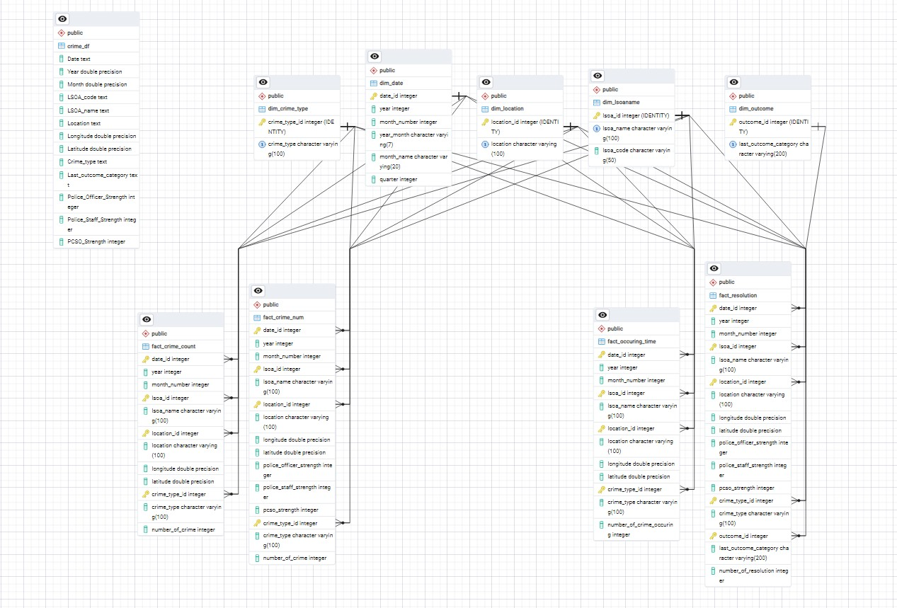

<h1 align="center">🏛 Crime Data Warehouse & Analytics Pipeline</h1>

  <strong>R ETL • Dimensional Modelling • PostgreSQL Warehouse • Data Quality Engineering • BI-Ready Fact Tables</strong>

  End-to-end data warehouse pipeline built for the UK Crime Dataset, featuring automated ETL in R, enriched data modelling, 
  and warehouse ready fact/dimension tables powering advanced crime analytics. 

  
  
  
  
 

---

  <em>This project demonstrates enterprise-level ETL design, dimensional modelling, and warehouse engineering for large-scale public safety analytics.</em>

---

# 📌 Project Overview

This project implements a **Crime Analytics Data Warehouse** using R for ETL and PostgreSQL for storage.  
The system ingests **over 2.2 million UK crime records**, enriches them with **police force strength data**, validates quality, and produces **clean staging data** for a Kimball-style warehouse schema.

The final dataset powers analytics on:

- Crime distribution by geography  
- Crime type trends over time  
- Crime outcomes and resolution rates  
- Relationship between crime and police staffing  

---

## 📦 End-to-End Crime Analytics Pipeline (ETL → Data Warehouse )

---

             ┌────────────────────────────────────┐
             │      Raw Crime Data Files          │
             │  (Monthly CSVs from data portal)   │
             └───────────────────┬────────────────┘
                                 │
                                 ▼
             ┌────────────────────────────────────┐
             │     R ETL Pipeline (crime_df)      │
             │  - File ingestion & merging        │
             │  - Data cleaning & NA handling     │
             │  - Business rules (behavioural)    │
             │  - Date parsing (YYYY-MM)          │
             │  - Join with Police Strength data  │
             └───────────────────┬────────────────┘
                                 │
                                 ▼
             ┌────────────────────────────────────┐
             │     PostgreSQL Staging Table       │
             │              crime_df              │
             │  - Clean, enriched crime records   │
             │  - Ready for dimensional loading   │
             └───────────────────┬────────────────┘
                                 │
                                 ▼
             ┌────────────────────────────────────┐
             │   Data Warehouse (Star Schema)     │
             │  - dim_crime_type                  │
             │  - dim_lsoaname                    │
             │  - dim_location                    │
             │  - dim_outcome                     │
             │  - dim_date                        │
             │  - fact_crime_num                  │
             │  - fact_crime_count                │
             │  - fact_crime_resolution           │
             │  - fact_occuring_time              │
             └───────────────────┬────────────────┘
                                 │
                                 ▼
             ┌────────────────────────────────────┐
             │   BI & Analytics Layer             │
             │  - Streamlit app / SQL reporting   │
             │  - Crime trend analysis            │
             │  - Hotspot & outcome insights      │
             │  - Staffing vs crime correlations  │
             └────────────────────────────────────┘
---

## 🧹 Crime Analytics ETL Pipeline (R)

This project includes an R-based **ETL pipeline** that prepares UK crime data for loading into the Crime Data Warehouse.

Raw data from multiple monthly CSV files and a secondary police strength dataset are:

### 🔄 Extracted
- All monthly crime CSV files are read from a folder using a custom `merge_csv_files()` function (`data.table::fread` + `rbindlist`).  
- Police force strength data is loaded from a separate CSV file and standardised.

### 🧪 Transformed
The script performs several transformation and data quality steps:

- **Column selection & renaming** – keep only relevant fields such as `Crime ID`, `Month`, `LSOA code`, `LSOA name`, `Location`, `Crime type`, and `Last outcome category`, then rename them to analysis-friendly names (`Crime_type`, `LSOA_name`, `Last_outcome_category`, etc.).
- **Missing value handling** – remove records with missing longitude and latitude, and inspect NA counts across all variables.
- **Business rule application** – map `Crime type = "Anti-social behaviour"` to a clearer outcome label `"Behavioral issues"`.
- **Date standardisation** – convert `Month` to `Date` in `"YYYY-MM"` format, with derived `Year` and `Month` fields.
- **Geospatial & contextual enrichment** – join crime data with `Police_Force_Strength` (police officer, staff and PCSO strength) on the standardised `Date` field.

The final transformed dataset is saved as `Crime_df`.

### 🗄 Loaded
The curated `Crime_df` table is then:

- Loaded into **PostgreSQL** using `DBI` + `RPostgres` as a staging table:

---

## 🏛 Crime Analytics Data Warehouse (SQL)

This project implements a Kimball-style **data warehouse** for UK crime data using SQL.

Source data from a staging table (`Crime_df`) is transformed into:

### 🔹 Dimension Tables
- `dim_crime_type` – types of crime (e.g. burglary, robbery, violence)  
- `dim_lsoaname` – LSOA names and codes for geographic analysis  
- `dim_Location` – free-text location descriptions  
- `dim_Outcome` – last outcome category (e.g. "Under investigation", "No further action")  
- `dim_date` – full calendar date dimension (day, month, quarter, year, year_month)

### 🔹 Fact Tables
Each fact table represents a different analytical “lens” on crime:

- `fact_Crime_Num` – number of crimes by date, area, location, type and police strength  
- `fact_Crime_Count` – alternative crime count grain by date, LSOA, location and type  
- `fact_Resolution` – number of resolved crimes by outcome and crime type  
- `fact_occurring_Time` – crime counts by day of week and location

All fact tables use **foreign keys** back to the dimension tables (`dim_crime_type`, `dim_lsoaname`, `dim_Location`, `dim_date`, `dim_Outcome`), forming a classic star schema.

---

**ERP Diagram**

---

**CMP_App** *[CMP_App](https://crime-data-warehouse-project-werssygoztfug6fijvbfew.streamlit.app)*

---

🔍 Key Insights - BI Solution using Streamlit App deployment

---

📊 Crime Distribution

- Crime is highly concentrated, with a small number of LSOAs and locations accounting for the majority of incidents.

- Violence & sexual offences and anti-social behaviour consistently represent the largest share of total crime.

---
⏱️ Time Patterns
---
- Crime levels show clear monthly seasonality, with recurring peaks and troughs across years.

- Temporal patterns are stable, indicating predictable demand cycles rather than random fluctuations.
---

📍 Geographic Hotspots
---
- Crime is geographically clustered, not evenly distributed.

- Persistent hotspots remain active across multiple periods, suggesting structural or environmental drivers rather than short-term anomalies.

---
👮 Police Strength vs Crime
---
- Higher police strength does not automatically result in lower crime volumes.

- Several high-crime areas already have relatively strong officer presence, indicating reactive deployment and diminishing returns at higher staffing levels.

- Workforce levels appear broadly stable while crime fluctuates, suggesting non-workforce drivers of crime.

---
✅ Crime Resolution
---
- Resolution success varies significantly by crime type.

- A small number of outcome categories account for most resolved cases.

- Some crime types show persistently low resolution volumes, highlighting investigative challenges and prioritisation gaps.

---
📈 Strategic Implications
---
- Targeted hotspot interventions are likely to be more effective than uniform resource increases.

- Time-based deployment planning can better align resources with predictable crime cycles.

- Performance improvements are more likely through focused investigation strategies than blanket workforce expansion.

### 🧠 What this enables

Analysts and BI tools (e.g. Power BI, Tableau) can now easily answer questions like:

- How do crime volumes vary by **crime type and LSOA** over time?  
- Which areas show the highest **crime resolution rates** by outcome category?  
- On which **day of the week** do specific crime types peak?  
- Is there any relationship between **police strength** and recorded crime volume?
